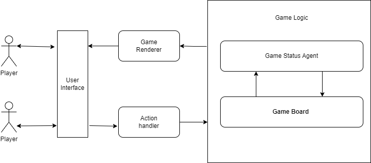

# N-Gomoku in Haskell

## Team Member
Linhan Li

Junhua Yang

Mudi Huang
## Introduction
Gomoku, Five in a Row, is a traditional two-player chess game on a grid board. The objective is to be the first player to create an unbroken row of five stones horizontally, vertically, or diagonally on the board. We improve the game by allowing users to define the rules of this game. They may decide how many stones in an unbroken row will select game winners. 

## Rules of Gomoku:
**Board**: The game is played on a square grid board, 15x15. 
**Players**: Two players take turns placing their stones on the intersections of the grid. 
**Define the rule**: Choose the number N (no less than 4). If a user first creates an unbroken row of N stones, the user wins the game. 
**Starting the Game**: One player uses black stones, and the other uses white stones. The game begins with an empty board. 
**Turns**: Players take turns placing one stone of their color on any vacant intersection of the grid. 
**Winning Condition**: The first player to create an unbroken row of N stones in a horizontal, vertical, or diagonal direction wins the game. These rows are often called "N-in-a-row." 
**Game End**: The game is a draw if the board fills up without a player achieving an N-in-a-row. 

## How to Play
Each player uses arrow keys to move stones on the board and presses "enter" to drop stones. 
The program will decide who wins the game. 

## Project Objectives:
1.Interactable N-Gomoku game 
2.With a local multiplayer mode. 
3.An online multiplayer mode 

## Project Management
The Project is divided into three milestones and may be adjusted based on team status. 
	**Milestone 1**:  Architecture and implementation of the logic of the N-Gomoku game. 
	**Milestone 2**:  Implementation of the UI of the N-Gomoku game. 
	**Milestone 3**:  Implementation of the network-related functions. 

## Update (12/01/23)
### 1. Architecture

The project is formed by three main parts: 
#### 1.1.User Interface
Users can interact with game logic by getting game status from User Interface(UI) and bypassing their actions to change game status via UI. 
#### 1.2.Game Logic
The game logic component contains two subparts: Game Board and Game Status Agent.  
**Game Board**: record game status  
**Status Agent**: to see if any user wins the game  
#### 1.3.Connecting Components
The connecting components contain two subparts: Game Renderer and Action Handler.  
**Game Renderer**: Rendering game status from game logic into UI, so the user can get game status from UI  
**Action Handler**: Processing actions from users' inputs and changing the game status accordingly  

### 2. Challenges
1. Development under the Brick Schema. We need to learn and implement Brick Schema in a short time, which is a challenging task. To tackle the Brick schema, we examined different examples listed in the official git repo. 
2. Game is a different application compared with other types of applications. It requires more interaction between the user and the system, so we took more time to consider different scenarios.  
3. We still need to tackle game AI and multiplayer-related issues. 

### 3. Expectations
The priority of the project is the stability of the game. Beyond stability, we will try to implement other game functions. If we cannot catch up with the original schedule, we'll try our best to implement gaming AI or online gaming.

   